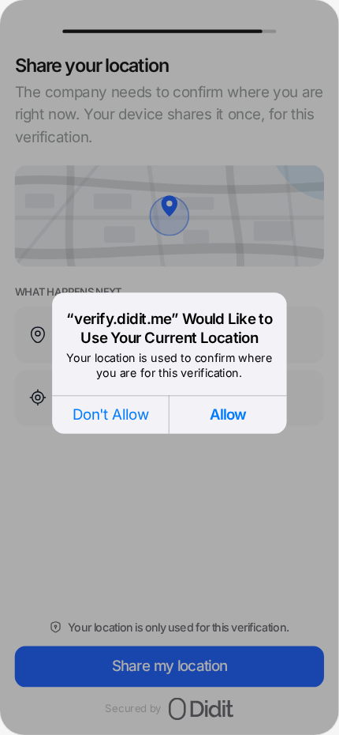
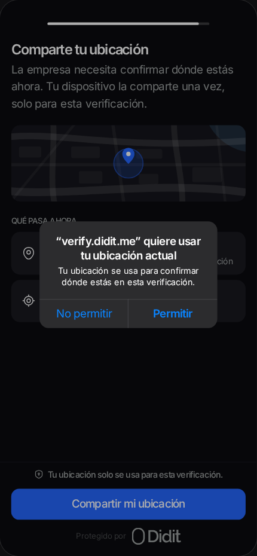

# Bank and Location steps in the Flutter wrapper

The wrapper draws no Bank or Location screen: the native SDKs draw both. This change adds no UI code. Its Kotlin and Swift changes are plugin unit tests, the helpers they reach, and the iOS mapping of the native `retryBlocked` error. The only text it controls that a person sees is the body of the iOS location permission prompt. The example app declares it in English (`Info.plist`) and Spanish (`es.lproj/InfoPlist.strings`).

These are the design's iOS permission frame for the Location step, the spec those strings follow. In each frame the prompt body is byte-identical to the string committed in the example app. iOS writes the title line itself from the app's name; only the body comes from the app.

| Light, English | Dark, Spanish |
|---|---|
|  |  |

| Language | Prompt body committed in the example app |
|---|---|
| English | Your location is used to confirm where you are for this verification. |
| Spanish | Tu ubicación se usa para confirmar dónde estás en esta verificación. |

**Nothing visible changed in this revision.** It changes no source; it only makes the merge instructions in the pull request description more precise. The prompt strings above are unchanged and still match the example app byte for byte.

**Not captured here.** This Linux sandbox has no Xcode and no Android emulator, so there is no device capture through the wrapper yet. A device capture needs a Mac or an Android device, plus a native SDK release that includes the steps. The native `retryBlocked` callback reaching Dart is proven by the iOS bridge test on a CI simulator (see Validation in the pull request).
